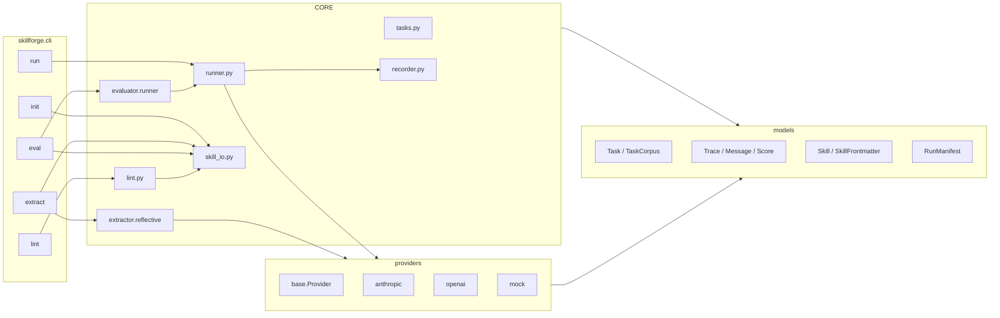
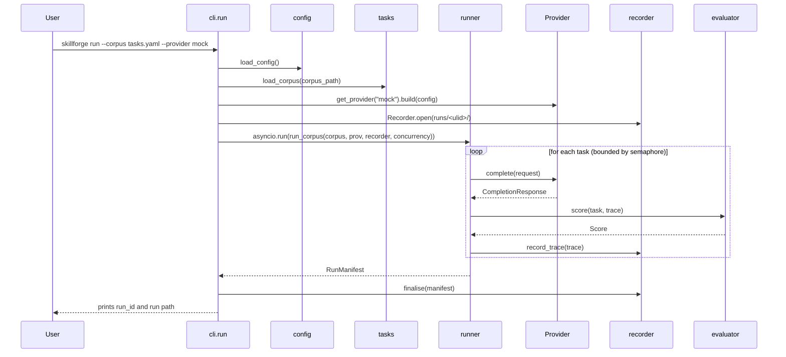
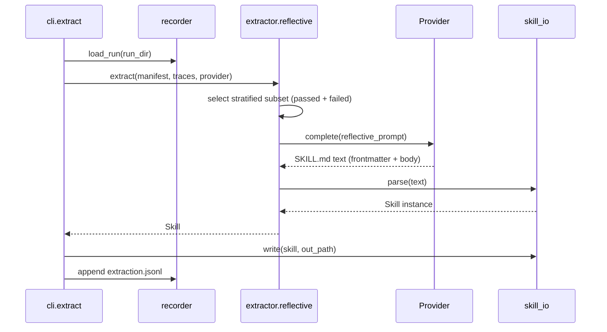
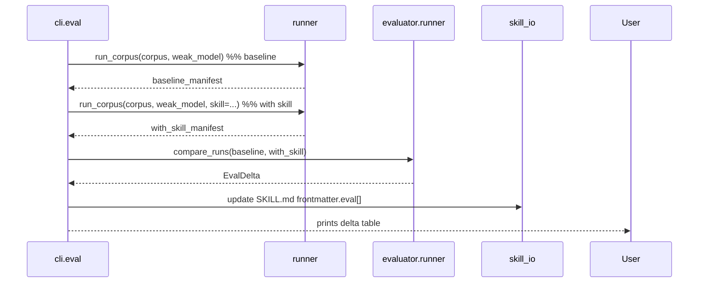

# Design — d-skill-forge MVP

> Audience: Kiro main agent + subagents. Subagents do **not** have access to specs; the main agent reads this design and embeds the relevant slice into each subagent invocation.

## 1. Architecture overview



The CLI is the only async/sync boundary. Everything below the CLI is `async`.

## 2. Sequence diagrams

### 2.1 `skillforge run`



### 2.2 `skillforge extract`



### 2.3 `skillforge eval`



## 3. Module contracts

The Pydantic models are documented in `.kiro/steering/models-contract.md`. This section documents the **behavioural** contracts of each module.

### 3.1 `skillforge.errors`

```python
class SkillForgeError(Exception): ...
class ConfigError(SkillForgeError): ...
class ProviderError(SkillForgeError): ...
class RateLimitError(ProviderError): ...
class AuthError(ProviderError): ...
class TraceError(SkillForgeError): ...
class ExtractionError(SkillForgeError): ...
class EvaluationError(SkillForgeError): ...
class SkillFormatError(SkillForgeError): ...
```

CLI's top-level catches `SkillForgeError`. Anything else propagates and is a bug.

### 3.2 `skillforge.config`

- `load_config(path: Path | None = None) -> Config` — reads `skillforge.toml` (default in CWD), validates with Pydantic, resolves provider keys via env vars.
- TOML shape is described in `.kiro/steering/product.md`.

### 3.3 `skillforge.providers.base`

```python
class Provider(ABC):
    name: ClassVar[str]
    @abstractmethod
    async def complete(self, request: CompletionRequest) -> CompletionResponse: ...
    @abstractmethod
    def supports(self, model: str) -> bool: ...
    @abstractmethod
    def estimate_cost(self, response: CompletionResponse) -> float: ...

class CompletionRequest(BaseModel):
    model: str
    messages: list[Message]
    system: str | None = None
    temperature: float = 0.7
    max_tokens: int = 4096
    thinking_budget_tokens: int | None = None
    tools: list[dict] = []            # provider-specific schemas, kept opaque
```

`providers/__init__.py` exposes a registry:

```python
PROVIDERS: dict[str, type[Provider]] = {}
def register(name: str) -> Callable[[type[Provider]], type[Provider]]: ...
def get_provider(name: str) -> Provider: ...
```

### 3.4 Concrete providers

- **`providers/anthropic.py`** — wraps `anthropic.AsyncAnthropic.messages.create`. Maps Anthropic content blocks (`text`, `thinking`, `tool_use`, `tool_result`) to `ContentBlock`. Computes cost from `providers/anthropic_prices.py`.
- **`providers/openai.py`** — wraps `openai.AsyncOpenAI` Responses API. Maps `reasoning` items to `ContentBlock(type="thinking")`. Pricing in `providers/openai_prices.py`.
- **`providers/mock.py`** — deterministic, network-free. Two model personas: `mock-strong` and `mock-weak`. Strong emits a multi-step plan + final correct answer (passes the task). Weak emits a shorter, often-incorrect answer. This makes eval deltas observable.

### 3.5 `skillforge.tasks`

- `load_corpus(path: Path) -> TaskCorpus`.
- `validate_corpus(corpus: TaskCorpus) -> list[str]` — checks duplicate IDs, missing rubrics for `llm_judge`, empty prompts.
- `interpolate(task: Task, run_vars: dict[str, str]) -> str` — `{{ var }}` substitution.

### 3.6 `skillforge.recorder`

- `Recorder.open(run_dir: Path) -> AsyncContextManager[Recorder]`.
- `await record_trace(trace: Trace) -> None` — appends one JSON line to `traces/<task_id>.jsonl`.
- `await finalise(manifest: RunManifest) -> None` — writes `manifest.json`.
- `load_run(run_dir: Path) -> tuple[RunManifest, list[Trace]]`.

### 3.7 `skillforge.runner`

```python
async def run_corpus(
    corpus: TaskCorpus,
    provider: Provider,
    model: str,
    *,
    skill: Skill | None = None,
    concurrency: int = 8,
    recorder: Recorder,
    evaluator: Evaluator,
) -> RunManifest: ...
```

- Concurrency via `asyncio.Semaphore`.
- Skill (if present) is prepended to the system prompt: `f"{skill.body}\n\n---\n\n{task.context or ''}"`.
- Catches per-task exceptions, stores them in `Trace.error`, continues.

### 3.8 `skillforge.extractor.reflective`

- `ReflectiveExtractor.extract(manifest: RunManifest, traces: list[Trace], provider: Provider, model: str) -> Skill`.
- Builds the distillation prompt from the template in `extractor/_prompts.py` (constant: `REFLECTIVE_EXTRACTION_PROMPT_V1`).
- The prompt requires the model to return YAML frontmatter + markdown body in a single block, parseable by `skill_io.parse`.
- Stratified sampling: at most `max_traces_per_pass` traces, biased toward passed traces but including ≥ 25% failed traces when available.
- Records its own call into `runs/<run_id>/extraction.jsonl`.

### 3.9 `skillforge.evaluator`

- `evaluator.base.Evaluator.score(task: Task, trace: Trace) -> Score`.
- `exact_match.ExactMatchEvaluator` handles `exact`, `regex`, `contains`, `executes_ok` (via `subprocess` with 5 s timeout; runs in a clean cwd).
- `llm_judge.LLMJudgeEvaluator` posts the rubric to a judge provider and parses a JSON `{passed, score, rationale}`.
- `evaluator.runner.compare_runs(baseline: RunManifest, with_skill: RunManifest) -> EvalDelta`.

### 3.10 `skillforge.skill_io`

- `parse(text: str) -> Skill` — splits on `---` fences, validates frontmatter with Pydantic.
- `dump(skill: Skill) -> str` — sorted YAML keys, LF line endings, trailing newline.
- `read(path: Path) -> Skill`, `write(skill: Skill, path: Path) -> None`.

### 3.11 `skillforge.lint`

- `lint_skill(skill: Skill) -> list[LintIssue]`:
  - Frontmatter fields present and non-empty.
  - Body has `## When to use`, `## Procedure`, `## Examples`, `## Anti-patterns`.
  - No section exceeds 400 lines.
  - Secret patterns: `sk-ant-[A-Za-z0-9-_]{20,}`, `sk-[A-Za-z0-9]{20,}`, `AKIA[0-9A-Z]{16}`.
  - At least one `## Examples` block referencing a `task_id`.

### 3.12 `skillforge.cli`

- `cli.main:cli` is the Click root group.
- Subcommands import their handler from `cli/<command>.py`.
- Top-level options: `--config <path>`, `-v/--verbose`, `-q/--quiet`.
- Each command catches `SkillForgeError` and prints a styled message with exit code 2 (config) or 3 (auth) or 1 (other).

## 4. Reflective extraction prompt — high-level shape

```
SYSTEM:
You just executed a corpus of tasks. Below are your own traces. Reflect on the
patterns that led to passes and the patterns that led to failures. Emit a
single SKILL.md (YAML frontmatter + markdown body) that a weaker model could
load to perform better on this domain.

USER:
# Corpus
<corpus.name>: <corpus.description>

# Traces (sampled)
{{ for each trace }}
## task_id: <id>  (passed=<bool>, score=<float>)
<<< messages summarized (thinking truncated to 400 chars) >>>
<<< final_output >>>
{{ endfor }}

# Output schema
Return exactly one fenced markdown document with YAML frontmatter:
---
name: <kebab-case>
description: <one sentence>
version: 0.1.0
source_model: <this model id>
extracted_from:
  total_traces: <int>
  passed_traces: <int>
  failed_traces: <int>
  extractor: reflective@0.1
  extracted_at: <iso-8601>
triggers: [<keyword>, ...]
domains: [<domain>, ...]
license: Apache-2.0
---
## When to use
## Procedure
## Examples
## Anti-patterns
```

## 5. Concurrency model

- All providers are async.
- `runner.run_corpus` uses a `Semaphore(concurrency)` to bound parallelism.
- Inside Kiro, the **main agent** spawns subagents per wave; subagents run in parallel but only operate on owned files.
- The CLI never blocks on user input mid-run.

## 6. Error handling at the CLI boundary

Pseudocode for `cli/main.py`:

```python
def cli() -> None:
    try:
        ...
    except AuthError as e:
        console.print(f"[red]auth error[/red]: {e}")
        raise SystemExit(3)
    except ConfigError as e:
        console.print(f"[red]config error[/red]: {e}")
        raise SystemExit(2)
    except SkillForgeError as e:
        console.print(f"[red]error[/red]: {e}")
        raise SystemExit(1)
```

## 7. Testing strategy

- **Unit tests** mirror module layout. Use the mock provider for any test that needs a `Provider`.
- **Integration tests** drive the Click CLI via `CliRunner` and assert on filesystem effects in `tmp_path`.
- **E2E test** at `tests/e2e/test_python_debug_example.py` runs the entire pipeline against `examples/python-debug/tasks.yaml` with `--provider mock` and asserts: produced SKILL.md validates frontmatter, contains all required sections, and `eval` reports a non-zero delta favouring the strong/weak persona split of the mock.
- **Smoke tests** under `@pytest.mark.smoke` exercise real Anthropic and OpenAI calls. Skipped in CI unless `RUN_SMOKE=1`.

## 8. CI

`.github/workflows/ci.yml`:

```yaml
name: ci
on:
  push:
    branches: [main]
  pull_request:

jobs:
  test:
    runs-on: ubuntu-latest
    strategy:
      matrix:
        python-version: ["3.11", "3.12"]
    steps:
      - uses: actions/checkout@v4
      - uses: astral-sh/setup-uv@v3
      - run: uv python install ${{ matrix.python-version }}
      - run: uv sync --all-extras
      - run: uv run ruff check src tests
      - run: uv run ruff format --check src tests
      - run: uv run pyright
      - run: uv run pytest --cov=skillforge --cov-report=term-missing --cov-fail-under=80
      - run: uv run mkdocs build --strict
```

## 9. Open questions deferred to v0.2

- Multi-extractor strategies (`contrastive`, `pattern-mine`).
- Streaming output formats.
- More providers (Bedrock, Gemini, Mistral, OpenRouter).
- An `export` command for fine-tuning datasets.

These do not block MVP and must not be built by subagents.
