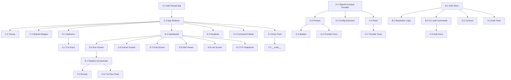

# d-skill-forge TUI Upgrade Plan

> **Version:** 1.0 — 2026-05-21
> **Goal:** Biến d-skill-forge từ CLI-only thành TUI-first tool với UX ngang opencode
> **Output format:** Giữ SKILL.md (YAML frontmatter + markdown body)
> **Inspiration:** opencode.ai TUI — `/connect`, `/models`, Tab mode, keybinds

---

## Executive Summary

| Aspect | Hiện tại | Sau upgrade |
|--------|----------|-------------|
| Interface | CLI-only (Click) | TUI-first + CLI fallback |
| Providers | 5 (anthropic, openai, bedrock, gemini, mock) | 15+ (thêm OpenAI-compatible layer) |
| Auth | Env vars only | `auth.json` + `/connect` wizard + env fallback |
| UX | `skillforge run --provider X` | Mở TUI → chọn provider → ấn nút chạy pipeline |
| Output | SKILL.md | SKILL.md (không đổi) |

---

## Architecture Overview

```
┌─────────────────────────────────────────────────────────────┐
│                    skillforge (entry point)                   │
├──────────────┬──────────────────────────────────────────────┤
│  TUI Layer   │  CLI Layer (backward compat)                  │
│  (Textual)   │  (Click, --no-tui)                           │
├──────────────┴──────────────────────────────────────────────┤
│                   Core Engine (unchanged)                     │
│  ┌─────────┐ ┌──────────┐ ┌───────────┐ ┌──────┐          │
│  │ Runner  │ │Extractor │ │ Evaluator │ │ Lint │          │
│  └────┬────┘ └────┬─────┘ └─────┬─────┘ └──┬───┘          │
│       └────────────┴─────────────┴───────────┘              │
│                   Provider Layer                              │
│  ┌──────────┐ ┌────────┐ ┌──────────────────────┐          │
│  │Anthropic │ │ OpenAI │ │ OpenAI-Compatible    │          │
│  │ Bedrock  │ │ Gemini │ │ (Groq/DS/Together/…) │          │
│  └──────────┘ └────────┘ └──────────────────────┘          │
├─────────────────────────────────────────────────────────────┤
│                   Auth Layer (NEW)                            │
│  auth.json ← /connect wizard ← env var fallback             │
└─────────────────────────────────────────────────────────────┘
```

---

## Phase A — Provider Matrix Expansion

### A.1 OpenAI-Compatible Base Provider

**File:** `src/skillforge/providers/openai_compat.py`

```python
@register("openai-compatible")
class OpenAICompatibleProvider(Provider):
    """Generic provider for any OpenAI-compatible API endpoint."""

    def __init__(self, base_url: str, api_key: str, name: str = "openai-compatible"):
        self._base_url = base_url
        self._api_key = api_key
        self._name = name

    async def complete(self, request: CompletionRequest) -> CompletionResponse:
        # Uses httpx directly (no SDK dependency)
        # POST {base_url}/chat/completions
        ...
```

### A.2 Provider Presets (zero-config)

**File:** `src/skillforge/providers/presets.py`

| Preset ID | Base URL | API Key Env | Default Model |
|-----------|----------|-------------|---------------|
| `groq` | `https://api.groq.com/openai/v1` | `GROQ_API_KEY` | `llama-3.3-70b-versatile` |
| `deepseek` | `https://api.deepseek.com/v1` | `DEEPSEEK_API_KEY` | `deepseek-chat` |
| `together` | `https://api.together.xyz/v1` | `TOGETHER_API_KEY` | `meta-llama/Llama-3-70b-chat-hf` |
| `fireworks` | `https://api.fireworks.ai/inference/v1` | `FIREWORKS_API_KEY` | `accounts/fireworks/models/llama-v3p1-70b-instruct` |
| `openrouter` | `https://openrouter.ai/api/v1` | `OPENROUTER_API_KEY` | `anthropic/claude-sonnet-4` |
| `xai` | `https://api.x.ai/v1` | `XAI_API_KEY` | `grok-3` |
| `ollama` | `http://localhost:11434/v1` | (none) | `llama3.2` |
| `lmstudio` | `http://localhost:1234/v1` | (none) | (auto-detect) |
| `nvidia` | `https://integrate.api.nvidia.com/v1` | `NVIDIA_API_KEY` | `nvidia/llama-3.1-nemotron-70b-instruct` |
| `cerebras` | `https://api.cerebras.ai/v1` | `CEREBRAS_API_KEY` | `llama3.3-70b` |

### A.3 Custom Provider via Config

```toml
# skillforge.toml
[providers.my-endpoint]
type = "openai-compatible"
base_url = "https://my-company.com/v1"
api_key_env = "MY_API_KEY"
default_model = "internal-model-v2"
```

### A.4 Dependency Changes

```toml
# pyproject.toml — NO new required deps for openai-compat (uses httpx already)
# Optional:
tui = ["textual>=3.0", "textual-dev>=1.0"]
```

### A.5 Tasks

| Task | Owns | Depends | Effort |
|------|------|---------|--------|
| A.1 | `providers/openai_compat.py` | — | 3h |
| A.2 | `providers/presets.py` | A.1 | 2h |
| A.3 | `config.py` (extend ProviderConfig) | A.1 | 1h |
| A.4 | `tests/unit/providers/test_openai_compat.py` | A.1 | 2h |

---

## Phase B — Auth & Credentials Management

### B.1 Auth Store

**File:** `src/skillforge/auth.py`

```python
AUTH_PATH = Path.home() / ".config" / "skillforge" / "auth.json"

class AuthStore:
    """Manages provider credentials in auth.json."""

    def get(self, provider: str) -> str | None: ...
    def set(self, provider: str, api_key: str) -> None: ...
    def delete(self, provider: str) -> None: ...
    def list_providers(self) -> list[str]: ...
```

**Format:**
```json
{
  "version": 1,
  "credentials": {
    "anthropic": { "api_key": "sk-ant-..." },
    "groq": { "api_key": "gsk_..." },
    "openrouter": { "api_key": "sk-or-..." }
  }
}
```

### B.2 Resolution Order

```
1. auth.json (highest priority — set by /connect)
2. Environment variable (ANTHROPIC_API_KEY, etc.)
3. Config file api_key_env reference
```

### B.3 CLI Subcommands

```bash
skillforge auth list          # Show configured providers
skillforge auth add <provider> # Interactive key input
skillforge auth remove <provider>
skillforge auth test <provider> # Ping with 1-token request
```

### B.4 Tasks

| Task | Owns | Depends | Effort |
|------|------|---------|--------|
| B.1 | `auth.py`, `tests/unit/test_auth.py` | — | 2h |
| B.2 | `config.py` (update resolve logic) | B.1 | 1h |
| B.3 | `cli/auth.py`, `tests/integration/test_auth_cli.py` | B.1 | 2h |

---

## Phase C — TUI Foundation

### C.1 Library Choice: Textual

| Criterion | Textual | Alternatives |
|-----------|---------|-------------|
| Python-native | ✅ | urwid (old), blessed (low-level) |
| Async-native | ✅ | — |
| Rich integration | ✅ (same author) | — |
| CSS-like styling | ✅ | — |
| Widget library | ✅ (buttons, tables, trees, inputs) | — |
| Snapshot testing | ✅ (built-in) | — |

### C.2 App Skeleton

**File:** `src/skillforge/tui/app.py`

```python
from textual.app import App, ComposeResult
from textual.widgets import Header, Footer

class SkillForgeApp(App):
    """d-skill-forge TUI application."""

    CSS_PATH = "theme.tcss"
    TITLE = "d-skill-forge"
    BINDINGS = [
        ("q", "quit", "Quit"),
        ("tab", "next_step", "Next Step"),
        ("ctrl+p", "command_palette", "Commands"),
        ("f1", "help", "Help"),
    ]

    def compose(self) -> ComposeResult:
        yield Header()
        yield PipelineBar()
        yield MainContent()
        yield StatusBar()
        yield Footer()
```

### C.3 Theme System

**File:** `src/skillforge/tui/theme.tcss`

```css
/* Catppuccin Mocha inspired */
$bg: #1e1e2e;
$fg: #cdd6f4;
$accent: #89b4fa;
$success: #a6e3a1;
$warning: #f9e2af;
$error: #f38ba8;
$surface: #313244;

Screen {
    background: $bg;
    color: $fg;
}

#pipeline-bar {
    height: 3;
    background: $surface;
}

.step-active { color: $accent; text-style: bold; }
.step-done { color: $success; }
.step-pending { color: $fg 50%; }
```

### C.4 Tasks

| Task | Owns | Depends | Effort |
|------|------|---------|--------|
| C.1 | `pyproject.toml` (add textual dep) | — | 0.5h |
| C.2 | `tui/__init__.py`, `tui/app.py` | C.1 | 3h |
| C.3 | `tui/theme.tcss` | C.2 | 1h |
| C.4 | `tui/widgets/__init__.py` (shared widgets) | C.2 | 2h |

---

## Phase D — TUI Screens

### D.1 Screen Map

```
┌─────────────────────────────────────────────────────┐
│ WelcomeScreen (first run, no auth)                  │
│   → "Press Enter to connect a provider"             │
├─────────────────────────────────────────────────────┤
│ ConnectScreen (/connect)                            │
│   → Provider picker → API key input → Test → Save  │
├─────────────────────────────────────────────────────┤
│ ModelScreen (/models)                               │
│   → List models for active provider → Select       │
├─────────────────────────────────────────────────────┤
│ DashboardScreen (main view after setup)             │
│   → Pipeline bar + corpus selector + run controls   │
├─────────────────────────────────────────────────────┤
│ RunScreen (during skillforge run)                   │
│   → Live progress, per-task status, cost ticker     │
├─────────────────────────────────────────────────────┤
│ ExtractScreen (during skillforge extract)           │
│   → Streaming extraction output, skill preview      │
├─────────────────────────────────────────────────────┤
│ EvalScreen (during skillforge eval)                 │
│   → Baseline vs with-skill comparison table         │
├─────────────────────────────────────────────────────┤
│ SkillViewerScreen                                   │
│   → Rendered SKILL.md with syntax highlighting      │
├─────────────────────────────────────────────────────┤
│ LintScreen                                          │
│   → Lint results with severity icons                │
└─────────────────────────────────────────────────────┘
```

### D.2 Key Interactions

| Screen | User Action | Result |
|--------|-------------|--------|
| Welcome | Enter | → ConnectScreen |
| Connect | Select provider | Show API key input |
| Connect | Paste key + Enter | Test connection → save → Dashboard |
| Dashboard | `1` or click Run | → RunScreen (starts execution) |
| Dashboard | `2` or click Extract | → ExtractScreen |
| Dashboard | `3` or click Eval | → EvalScreen |
| Dashboard | `4` or click Lint | → LintScreen |
| RunScreen | `Esc` | Cancel run, return to Dashboard |
| Any | `Ctrl+P` | Command palette |
| Any | `/` | Slash command input |

### D.3 Tasks

| Task | Owns | Depends | Effort |
|------|------|---------|--------|
| D.1 | `tui/screens/welcome.py` | C.2 | 1h |
| D.2 | `tui/screens/connect.py` | C.2, B.1 | 3h |
| D.3 | `tui/screens/models.py` | C.2, A.2 | 2h |
| D.4 | `tui/screens/dashboard.py` | C.2 | 3h |
| D.5 | `tui/screens/run.py` | C.2, runner | 4h |
| D.6 | `tui/screens/extract.py` | C.2, extractor | 3h |
| D.7 | `tui/screens/eval.py` | C.2, evaluator | 3h |
| D.8 | `tui/screens/skill_viewer.py` | C.2 | 2h |
| D.9 | `tui/screens/lint.py` | C.2, lint | 1h |

---

## Phase E — Pipeline Orchestrator + Streaming

### E.1 Pipeline State Machine

```python
class PipelineState(Enum):
    IDLE = "idle"
    RUNNING = "running"
    EXTRACTING = "extracting"
    EVALUATING = "evaluating"
    LINTING = "linting"
    DONE = "done"
    ERROR = "error"

class PipelineOrchestrator:
    """Drives the full distillation pipeline with event callbacks."""

    async def run_full(self, *, on_progress: Callable) -> None:
        """Run → Extract → Eval → Lint in sequence."""
        ...

    async def run_step(self, step: PipelineState) -> None:
        """Run a single step."""
        ...
```

### E.2 Streaming Updates

- Runner emits `TaskStarted`, `TaskCompleted`, `TaskFailed` events
- TUI subscribes via Textual's message system
- Real-time progress bar + per-task status table

### E.3 Keybinds

| Key | Action | Context |
|-----|--------|---------|
| `q` | Quit | Global |
| `Tab` | Next pipeline step | Dashboard |
| `Shift+Tab` | Previous step | Dashboard |
| `Enter` | Execute current step | Dashboard |
| `Ctrl+P` | Command palette | Global |
| `/` | Slash command | Global |
| `Ctrl+C` | Cancel current operation | During run |
| `s` | View skill | After extract |
| `r` | Re-run | After eval |
| `1-4` | Jump to step | Dashboard |

### E.4 Command Palette

```
/connect     — Add/change provider credentials
/models      — Select model
/corpus      — Select task corpus file
/run         — Start corpus run
/extract     — Extract skill from last run
/eval        — Evaluate skill
/lint        — Lint skill
/config      — Open config
/help        — Show help
/quit        — Exit
```

### E.5 Tasks

| Task | Owns | Depends | Effort |
|------|------|---------|--------|
| E.1 | `tui/pipeline.py` | runner, extractor, evaluator | 4h |
| E.2 | `tui/events.py` | E.1 | 2h |
| E.3 | `tui/app.py` (bindings) | C.2 | 1h |
| E.4 | `tui/command_palette.py` | C.2 | 2h |

---

## Phase F — CLI Integration

### F.1 Entry Point Logic

```python
# src/skillforge/cli/main.py
def main() -> None:
    """Entry point: TUI by default, CLI with --no-tui or subcommands."""
    if len(sys.argv) == 1:
        # No args → launch TUI
        from skillforge.tui.app import SkillForgeApp
        app = SkillForgeApp()
        app.run()
    else:
        # Has args → traditional CLI
        cli(standalone_mode=False)
```

### F.2 Backward Compatibility

| Invocation | Behavior |
|------------|----------|
| `skillforge` | Launch TUI |
| `skillforge --no-tui` | Print help (CLI mode) |
| `skillforge run --provider mock` | CLI mode (existing behavior) |
| `skillforge extract ...` | CLI mode |
| `skillforge auth list` | CLI mode |

### F.3 Tasks

| Task | Owns | Depends | Effort |
|------|------|---------|--------|
| F.1 | `cli/main.py` (modify entry) | C.2 | 1h |
| F.2 | `__main__.py` | F.1 | 0.5h |
| F.3 | Integration tests | F.1 | 2h |

---

## Phase G — Docs & Examples

### G.1 Deliverables

| Doc | Content |
|-----|---------|
| `docs/tui.md` | TUI guide with screenshots |
| `docs/providers.md` | Updated provider matrix (all 15+) |
| `docs/auth.md` | Auth setup guide |
| `README.md` | Updated with TUI screenshot + new provider table |
| `examples/` | Asciinema recording script |

### G.2 Tasks

| Task | Owns | Depends | Effort |
|------|------|---------|--------|
| G.1 | `docs/tui.md` | D.* | 2h |
| G.2 | `docs/providers.md` (rewrite) | A.* | 1h |
| G.3 | `docs/auth.md` | B.* | 1h |
| G.4 | `README.md` (update) | G.1-G.3 | 1h |

---

## Phase H — Testing Strategy

### H.1 Test Layers

| Layer | Tool | Coverage |
|-------|------|----------|
| Unit (providers) | pytest + respx | OpenAI-compat, presets, auth |
| Unit (TUI) | Textual snapshot tests | Each screen renders correctly |
| Integration | CliRunner + tmp_path | Full pipeline via CLI |
| TUI Integration | Textual pilot | User flows (connect → run → extract) |
| E2E | Full pipeline mock | `skillforge` → TUI → run → skill output |

### H.2 Textual Snapshot Testing

```python
async def test_dashboard_renders():
    async with SkillForgeApp().run_test() as pilot:
        await pilot.press("tab")
        assert pilot.app.query_one("#pipeline-bar")
```

### H.3 Tasks

| Task | Owns | Depends | Effort |
|------|------|---------|--------|
| H.1 | `tests/unit/providers/test_openai_compat.py` | A.1 | 2h |
| H.2 | `tests/unit/test_auth.py` | B.1 | 1h |
| H.3 | `tests/tui/` (snapshot tests) | D.* | 4h |
| H.4 | `tests/integration/test_tui_flows.py` | E.* | 3h |

---

## Dependency DAG



---

## Execution Waves

| Wave | Tasks | Parallelism | Gate |
|------|-------|-------------|------|
| **1** | A.1, B.1, C.1 | 3 parallel | `pytest` pass |
| **2** | A.2, A.3, B.2, B.3, C.2, C.3, C.4 | 7 parallel | `ruff + pyright` pass |
| **3** | D.1–D.9, A.4 | 10 parallel | TUI renders without crash |
| **4** | E.1–E.4, F.1, F.2 | 6 parallel | Full pipeline runs in TUI |
| **5** | G.1–G.4, H.1–H.4 | 8 parallel | Docs build, coverage ≥ 75% |

---

## Effort Estimate

| Phase | Hours | Priority |
|-------|-------|----------|
| A — Providers | 8h | P0 (unblocks everything) |
| B — Auth | 5h | P0 |
| C — TUI Foundation | 6.5h | P0 |
| D — TUI Screens | 22h | P1 |
| E — Pipeline + UX | 9h | P1 |
| F — CLI Integration | 3.5h | P1 |
| G — Docs | 5h | P2 |
| H — Testing | 10h | P1 |
| **Total** | **~69h** | ~2 weeks (1 dev) |

---

## File Ownership (New Files)

```
src/skillforge/
├── auth.py                          # Phase B
├── providers/
│   ├── openai_compat.py             # Phase A
│   └── presets.py                   # Phase A
├── tui/
│   ├── __init__.py                  # Phase C
│   ├── app.py                       # Phase C
│   ├── theme.tcss                   # Phase C
│   ├── pipeline.py                  # Phase E
│   ├── events.py                    # Phase E
│   ├── command_palette.py           # Phase E
│   ├── widgets/
│   │   ├── __init__.py
│   │   ├── pipeline_bar.py
│   │   ├── status_bar.py
│   │   ├── task_table.py
│   │   └── cost_ticker.py
│   └── screens/
│       ├── __init__.py
│       ├── welcome.py               # Phase D
│       ├── connect.py               # Phase D
│       ├── models.py                # Phase D
│       ├── dashboard.py             # Phase D
│       ├── run.py                   # Phase D
│       ├── extract.py               # Phase D
│       ├── eval.py                  # Phase D
│       ├── skill_viewer.py          # Phase D
│       └── lint.py                  # Phase D
├── cli/
│   └── auth.py                      # Phase B
tests/
├── unit/
│   ├── providers/test_openai_compat.py
│   └── test_auth.py
├── tui/
│   ├── __init__.py
│   ├── test_app.py
│   ├── test_connect_flow.py
│   └── snapshots/
└── integration/
    ├── test_auth_cli.py
    └── test_tui_flows.py
```

---

## Output Format Decision: SKILL.md ✅

**Giữ nguyên SKILL.md** vì:

1. **LLM-native** — paste thẳng vào context window, không cần convert
2. **Human-readable** — đọc/edit bằng bất kỳ editor nào
3. **Git-friendly** — diff/merge dễ dàng
4. **Structured metadata** — YAML frontmatter cho eval scores, triggers, version
5. **Ecosystem proven** — opencode dùng AGENTS.md, cursor dùng .cursorrules, cùng pattern
6. **Backward compatible** — không break existing skills

**Enhancement:** Thêm `.skill.md` extension recognition trong TUI skill viewer với syntax highlighting cho frontmatter.

---

## Risk & Mitigation

| Risk | Impact | Mitigation |
|------|--------|------------|
| Textual breaking changes | High | Pin `textual>=3.0,<4.0` |
| Provider API changes | Medium | OpenAI-compat layer abstracts away |
| auth.json security | Medium | File permissions 600, warn if world-readable |
| TUI không chạy trên Windows Terminal cũ | Low | Fallback to CLI, document requirements |
| Context window limit khi paste SKILL.md | Low | Lint rule: max section size |

---

## Success Criteria

- [ ] `skillforge` (no args) → TUI launches in < 1s
- [ ] `/connect` → chọn Groq → paste key → test pass → save
- [ ] `/models` → list models → select
- [ ] Ấn `1` → Run pipeline → live progress → complete
- [ ] Ấn `2` → Extract → SKILL.md generated
- [ ] Ấn `3` → Eval → delta table shown
- [ ] `skillforge run --provider groq --no-tui` → backward compat works
- [ ] Coverage ≥ 75% trên code mới
- [ ] `mkdocs build --strict` passes
