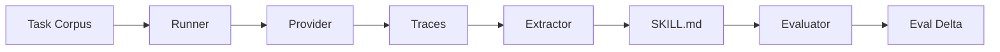
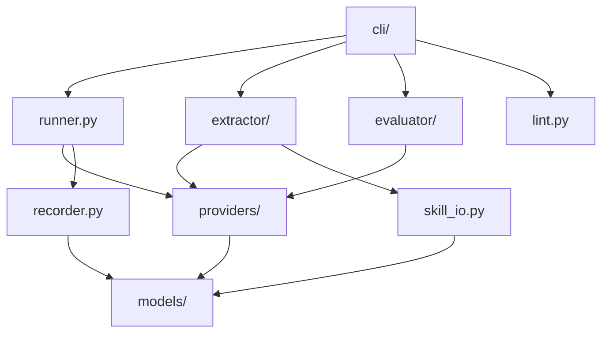

# Architecture

## System overview

## Module layers

## Data flow

1. **`skillforge run`** — CLI loads config and corpus, instantiates a provider, creates a Recorder, and calls `run_corpus()`. The runner executes tasks with bounded concurrency via `asyncio.Semaphore`, records each trace, and writes a manifest.

2. **`skillforge extract`** — CLI loads the run manifest and traces, instantiates the ReflectiveExtractor, which stratified-samples traces and sends a reflection prompt to the provider. The response is parsed into a Skill and written to disk.

3. **`skillforge eval`** — CLI runs the corpus twice (baseline without skill, augmented with skill), then compares the two manifests to compute an EvalDelta. The delta is printed and appended to the SKILL.md frontmatter.

4. **`skillforge lint`** — CLI reads and parses a SKILL.md, then runs structural checks (required sections, secrets, section length).

## Key design decisions

- **No global state** — all configuration is passed explicitly through function arguments
- **Async providers** — all LLM calls are async, enabling concurrent task execution
- **Typed errors** — every failure mode has a specific exception type; the CLI catches `SkillForgeError` at the boundary
- **Deterministic mock** — the mock provider enables full pipeline testing without network or API keys
- **Pydantic models** — all persisted artifacts (traces, manifests, skills) are validated Pydantic v2 models
